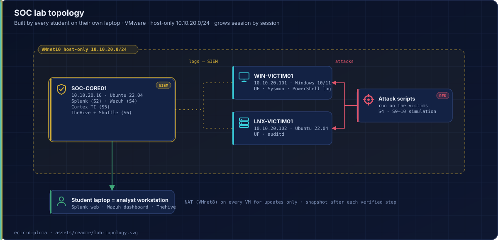

<p align="center"></p>

<p align="center">
  
  
  
  
  <a href="https://ebrahim-qareen.github.io/ecir-diploma/"></a>
</p>

Practical SOC / DFIR course built for the INE **eCIR** (Enterprise Cyber Incident Response) exam. Ten four-hour sessions, a SOC lab every student builds, and investigation challenges with real datasets.

Static HTML. No build step, no dependencies. Runs offline in a classroom.

**Live site →** https://ebrahim-qareen.github.io/ecir-diploma/

## Course arc

<p align="center"></p>

| Block | Sessions | Focus |
|---|---|---|
| Foundations | 1–2 | IR lifecycle (NIST), SOC roles, lab build, log sources |
| Detection | 3–5 | SIEM analysis, Windows / Linux telemetry, network traffic, ATT&CK mapping |
| Investigation | 6–8 | Endpoint and memory triage, malware behaviour, lateral movement, persistence |
| Response | 9–10 | Containment, eradication, recovery, reporting, capstone investigation |

## SOC lab

<p align="center"></p>

One lab, built in Session 2 and grown every session after. By the end it is a working miniature SOC the student keeps.

| Session | You add |
|---|---|
| 2 | VMs, network, Splunk, forwarders |
| 3 | Sysmon, PowerShell logging, auditd |
| 4 | Attack tooling, Wazuh, detection rules, dashboards |
| 5 | Threat-intel enrichment (Cortex) |
| 6 | TheHive + Shuffle (IR + SOAR) |
| 7–8 | Analyst toolchain, network sensor |
| 9–10 | DFIR acquisition toolkit, full attack simulation |

## What students get

- **Ten lecture pages** — paged, with break timer, in-page quizzes and homework
- **A SOC lab** — Splunk + Wazuh, with a setup guide and a verification step after every part
- **Investigation challenges** — alert-driven cases with datasets; each ends in a written incident report
- **Cheat sheets and resource hubs** — Windows event IDs, Sysmon, KQL / SPL, MITRE ATT&CK, IR templates

## Repository layout

| Path | Purpose |
|---|---|
| `index.html` | Course dashboard |
| `session-01/ … session-10/` | Lecture pages |
| `lab/` | Lab overview, setup guide, challenges, datasets, Wazuh rules, YARA |
| `cheatsheets/`, `resources/` | Reference hubs |
| `assets/` | CSS, JS, images, README diagrams |

## Running locally

```bash
python3 -m http.server 8000
```

## Security note

The private lab build log with real credentials is **not** in this repository. Datasets contain no real personal data. Every scenario is purpose-built.

## Credits and licence

Course material © ITGate Academy. Primary reference: INE eCIR v2. TryHackMe content is linked, not republished.

**Ebrahim Mohamed** — Lead Cybersecurity Instructor · SOC Analyst
[LinkedIn](https://linkedin.com/in/EbrahimMohamed) · [GitHub](https://github.com/Ebrahim-Qareen)
